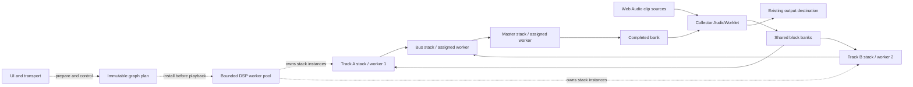

# Realtime effect stacks across worker threads

Status: proposed design, 29 September 2026. The metering worker is implemented;
the DSP backend described here is not. Initial delivery targets Soundscaper
desktop, followed by the same backend on web after browser qualification.

## Decision

Process the mixer in fixed-size blocks through a bounded pool of dedicated
workers. Each track, group, send, cue, and master stack is a task. Its effects
run in order on one worker; independent stacks can run concurrently. A stack's
DSP state stays with its worker for the lifetime of a playback generation.

Buffer the complete mixer graph once. Track → group → master dependencies run
within that block's processing window and share one output deadline. Adding a
separate asynchronous bridge to every stack would add latency at every stage.

One AudioWorklet collects the existing source graph's track inputs and plays
completed mixer output. Explicit terminal tasks sum and align the final outputs.
The collector never waits for a worker. The UI prepares graphs and
sends controls; it does not dispatch blocks or relay their PCM.

Use a pool rather than an OS thread for every stack. Many stacks can share a
worker. More workers help only when the graph has independent ready work; one
expensive serial stack remains a limit on throughput.



## Existing code and constraints

| Existing piece | Reuse or required change |
| --- | --- |
| [V21 mixer graph](../src/common/editor/engine/project-graph-v21.ts) | Preserve stack order, taps, channel maps, mute/solo/VCA, sends, cues, and output alignment. Add a separate worker-backed graph builder. |
| [Mixer validation](../src/common/editor/mixer-graph-v21.ts) | Keep its acyclic graph rule, including sidechain edges. |
| [Path delay compensation](../src/common/editor/engine/project-path-pdc-plan-v21.ts) | Reuse its intrinsic latency solve and parameter offsets. Add the common pipeline delay once at the output boundary. |
| [Clip scheduler](../src/common/editor/engine/clip-scheduler.ts) | Keep decoding, source scheduling, clip gains/fades, and prepared time/pitch audio upstream of the collector. |
| [Standard DSP](../src/common/editor/first-party-effects/standard/dsp.ts) | Reuse worker-independent processors after auditing allocations and parameter updates. |
| [Parameter bindings](../src/common/editor/engine/effect-parameter-bindings.ts) | Some current worklets do not consume frame-offset events. Add a real sample-timed consumer before admitting those automation targets. |
| [Native plug-in bridge](../src/common/editor/native-plugin-realtime-worklet.js) | Existing four-quantum buffering is per plug-in. It is a separate backend with separate isolation and latency contracts. |
| [Native output adapter](../src/common/editor/soundscaper-native-audio-renderer.ts) | It receives the existing AudioContext output; selecting native I/O does not move the whole mixer into a native DSP pool. |

Web Audio associates an AudioWorklet global scope with one rendering thread per
context. Creating more AudioWorkletNodes therefore does not give our stack
processors independent threads. [W3C Web Audio specification](https://www.w3.org/TR/webaudio-1.0/#AudioWorkletGlobalScope)

Shared memory avoids per-block message allocation. Ordinary workers have weaker
scheduling guarantees than the audio rendering thread; buffering tolerates some
scheduling delay but cannot guarantee deadlines on an overloaded machine.
[Chromium's AudioWorklet design guidance](https://developer.chrome.com/blog/audio-worklet-design-pattern/)

The [web headers](../public/_headers) and [desktop protocol](../desktop/protocol.js)
already provide isolation headers and worker permissions. Admission must still
prove `crossOriginIsolated`, shared-memory exchange, and AudioWorklet operation
in the actual browser or packaged Electron process. Shared memory has runtime
security requirements. [MDN isolation reference](https://developer.mozilla.org/en-US/docs/Web/API/WorkerGlobalScope/crossOriginIsolated)

## Block geometry and thread ownership

The following are prototype settings, subject to measured admission gates:

| Setting | Initial value |
| --- | --- |
| Render quantum `Q` | Read from the callback; qualify the initial implementation for 128 frames. |
| DSP block `B` | 256 context-rate frames, two qualified quanta. |
| Common pipeline delay `Lpipe` | 768 frames, three blocks. |
| Processing window after collection | `Lpipe - B = 512` frames. |
| Shared banks `K` | 8; require at least `ceil(Lpipe / B) + 2`. |
| Worker count `W` | At most 8, at most the admitted stack count, initially bounded by `hardwareConcurrency - 2`, with a floor of 1. Treat that API as a hint and use measured admission. |

At 48 kHz this adds 16 ms and allows 10.67 ms from block collection to its first
output frame. At 96 kHz those numbers halve, so the same frame counts do not
provide the same scheduling margin. A larger mode can be selected only while
stopped; block size and latency stay fixed within a running generation.
Align the generation's future context-frame origin to `Q`. An unsupported or
changed callback quantum faults the generation and requires re-preparation;
never resize live banks or reinterpret a partially collected block.

For block `k`, the collector gathers input frames `[kB, (k+1)B)`. It publishes
the bank after collecting the last frame. Output for that bank begins at
`kB + Lpipe`, relative to the generation's context-frame origin. Intrinsic DSP
delays are already present in the processed samples and add to audible latency.

| Owner | Responsibilities |
| --- | --- |
| UI/controller | Compile/admit the graph, prepare workers and modules, schedule source playback, publish bounded controls, observe failures. |
| Collector AudioWorklet | Copy inputs, publish banks, assign controls to future processing frames, consume exact due output, maintain the output clock. |
| Each DSP worker | Own assigned stack instances, terminal tasks, scratch and edge-delay state; execute ready tasks; publish output and completion. |
| Existing output backend | Deliver completed AudioContext output to the browser or native device route. |

Compilation, allocation, module loading, state restore, and warmup finish before
playback. Reset warmup DSP and random-generator state before processing real
input. The collector performs no allocation, imports, promises, blocking calls,
or per-block `postMessage` traffic in `process()`.

## Graph compilation and scheduling

Compile an immutable plan containing stack IDs, effect instances, channel
layouts, ordered edges, sidechain targets, PDC delays, automation tables, output
ports, memory offsets, and worker assignments. Bind it to the exact project and
transport generation. Validate all counts and checked byte totals before use.

Each stack task performs these steps:

1. Read its local source input and completed predecessor taps for this block.
2. Apply channel maps and persistent compensation delay lines. Apply edge gain
   after compensation and sum incoming edges in their stable graph order.
3. Run effects serially, using the aligned sidechain for each addressed effect.
4. Publish the pre-fader tap, then apply gain, pan, mute/solo, and VCA and publish
   the post-fader tap. Here, **pre-fader is after the complete effect rack**.
5. Publish completion only after every owned output plane has been written.

Preserve mono-to-stereo widening at the panner and the distinct pre/post tap
widths. One destination owner performs each fan-in sum; workers never accumulate
concurrently into the same PCM plane. Muted stacks may still be needed for
pre-fader sends, sidechains, and effect tails.

Each terminal output has a designated sink task. Its worker maps output edges,
applies edge PDC before edge gain, sums in stable order, and applies final
`Lgraph - Loutput` alignment into its exclusively owned output planes. Sink tasks
own their persistent delay lines and participate in task readiness and the
unfinished-task count. A bank
is not complete merely because every effect stack has finished.

A task is ready when its bank is published, its preceding block has completed
on this stack, and every programme/sidechain predecessor is done for this exact
bank. Waiting for all sidechains before starting a stack is conservative but
keeps its execution serial. Release a consumer as soon as its predecessors
finish; there is no barrier across an entire graph level.
Keep a private next-block sequence for each task; a reused bank's completion
word cannot establish that task's history across ring wrap.

Assign stateful stacks to workers before playback using measured cost and graph
dependencies. Each worker scans its bounded assigned task set, choosing the
earliest ready block, then a stable critical-path order. Keep effects and WASM
memory private to that worker. Initial delivery has no work stealing or live
state migration and needs no separate scheduler thread in the block path.

Use one atomic wake counter per worker. Read it **before** scanning for work;
if none is ready, wait on that observed value. Producers increment and notify
after publishing ingress or dependency completion. This avoids lost wakeups.
Only DSP workers can sleep; the collector always returns on time.
Every stop, fault, or retirement publisher must also increment and notify
**all** worker wake counters after publishing the generation flag. Workers
check that flag immediately after waking and before starting each task, so an
idle worker can acknowledge retirement even after ingress has stopped.

A blocking worker loop cannot also rely on `postMessage` callbacks to receive
live controls. Prepare the complete generation before entering the loop and
carry stop flags and timed controls through shared state.

## Shared memory protocol

Allocate fresh shared slabs for each playback generation. Each of the `K` banks
has ingress planes, separate pre/post stack output planes, terminal output
planes, bounded event descriptors, identity metadata, task completion words,
and an unfinished-task count. Persistent effect and PDC delay state lives outside
the banks, privately owned by its worker.

The state transitions and ownership are:

| State | Writer and allowed access |
| --- | --- |
| `FREE → CAPTURING` | Collector claims the expected bank and writes ingress/metadata. No worker may read it yet. |
| `INPUT_READY` | Collector atomically publishes immutable ingress, block identity, and controls. |
| Task `WAITING → RUNNING → DONE` | The assigned worker alone writes that task's output planes. Readers require its atomic `DONE` publication. A task cannot decrement the count twice. |
| `COMPLETE` | The last completed task publishes this only after **all admitted tasks** finish, including non-master sinks. |
| `READING → FREE` | Collector reads the exact due bank and releases it only after its last output frame is copied. |

PCM uses ordinary Float32 reads/writes under this ownership protocol; atomic
publication controls when another thread can read it. Writers never alter a
published plane. Fan-out readers see immutable output until the whole bank is
released. Ring wrap never grants permission to overwrite an active bank.

Identity includes generation, block sequence, context-frame start, valid frame
count, and control revision references. A bank can straddle a loop boundary;
represent bounded segment spans within it or precompile its events into absolute
processing frames instead of assuming one transport segment per bank.
Use checked safe-integer frame
metadata or split words; a signed 32-bit absolute frame counter is insufficient.
Sequence counters must not wrap ambiguously within a generation.

Account for memory before admission:

```text
bank PCM bytes = K × B × 4 × (ingress planes + tap planes + terminal planes)
total = bank PCM + metadata/events + DSP state/scratch + PDC delay lines
```

Use explicit graph/task/channel/event and total-memory limits. Include duplicated
old/new generation memory during replacement. Reuse the existing effect state
estimators where available. If the plan does not fit, select the conventional
graph before playback; do not grow storage from an audio callback.

## Latency compensation and automation

Use the existing PDC compiler as the semantic reference. In context frames, let
`λ(s)` be active rack latency, `p(s,e)` the active latency before effect `e`,
`I(s)` stack input alignment, and `O(s) = I(s) + λ(s)` its output latency.

```text
I(s) = max(0,
           O(u) for each programme input u,
           O(u) - p(s,e) for each sidechain u → effect e)
programme edge delay = I(s) - O(u)
sidechain edge delay = I(s) + p(s,e) - O(u)
Lgraph = maximum aligned output latency from the existing PDC plan
Laudible = Lpipe + Lgraph
```

Apply track input alignment even when the programme source is a local clip;
sidechains can increase that alignment. Preserve authored bypassed slots for
sidechain addressing while excluding their inactive DSP latency. Delays internal
to an effect remain its private state; inter-stack feedback remains rejected.

For transport segment `j`, let `fj` be its project-frame start, `Rj` its monotonic
processing-frame origin, `Rp` the project rate, `Rc` the context rate, and `vj`
its speed. Convert project frame `f` once using the existing rational rounding
helper:

```text
r(f) = Rj + round((f - fj) × Rc / (Rp × vj))
effect event frame = r(f) + I(s) + p(s,e)
strip control frame = r(f) + O(s)
edge control frame = r(f) + O(source) + edge delay
```

These are worker processing coordinates. The collector adds `Lpipe` at output;
adding it again to worker events would misalign automation. Update position,
monitoring, output timestamp, and end-of-range accounting consistently. Preserve
the device backend's additional latency as a separate component.

Preload admitted authored automation into immutable, budgeted worker tables.
Implement set events and linear ramps at sample offsets within a block; offset
`B` belongs to the next block. A kernel must support allocation-free updates and
the exact ramp semantics before that automated target is admitted. Merely
calling the existing whole-block `updateParams()` method is insufficient.

Interactive controls enter a bounded UI-to-collector inbox. The collector accepts
a complete revision only after reserving capacity for every target in a bounded,
preallocated pending-event schedule. Choose one future semantic source frame
`R`, then map each target to `R + targetLatency` using the same offsets as authored
automation. These events can occupy different banks: sealing all targets at one
processing frame would misalign routes with different PDC offsets. Copy events
into their bank before atomic publication and retain pending entries until that
copy is complete. Acknowledge the revision's effective aligned output frame
`R + Lgraph + Lpipe`.

Late requests move the complete revision to the next safe source frame, so no
target lands in an already published bank. Multi-target changes such as solo
remain coherent after output alignment. Queue exhaustion is an explicit refusal
or stop/reprepare, never silent event loss. Latency-changing parameters and
structural edits require a new graph plan.

## Admission, failures, and transport

Initial admission is for the **entire mixer graph**. Every active effect,
automation target, routing mode, source mode, and channel layout must have an
adapter with verified semantics. Otherwise use the existing complete graph.
This avoids repeated worker/Web Audio crossings and their extra delays.

Keep the existing clip source path feeding canonical, discrete collector
inputs. Verify multi-input channel widths and limits in the browser. Treat
prepared speed playback, audio warp, cut preview, scrub, ADM routing, external
outputs, and live monitoring as explicit capabilities; first delivery admits
ordinary forward playback and falls back for unqualified modes.

| Event | Required behavior |
| --- | --- |
| Startup | Prepare/acknowledge workers, reset warmup state, establish one future context-frame origin, and prime the fixed pipeline with silence. |
| First missing deadline or full bank | Collector atomically faults the generation, ramps its last output to silence over at most one quantum, stops publishing input, and requests transport stop. A strict render fails. |
| Worker crash or hang | The collector detects the missed output even if the UI cannot handle an error event. Other workers observe the shared fault flag. |
| Late completion | It can write only retired-generation memory and can never become audible or touch replacement banks. |
| Seek, pause/resume, restart | Follow current transport reset semantics with a fresh generation. Never carry a partial block across a restart. |
| Ordinary loop boundary | Keep the monotonic processing clock and DSP histories; advance the project-time segment and preserve current loop scheduling semantics. |
| Stop | Collector silences output on observing the shared stop flag, by its next callback; worker shutdown and resource cleanup happen afterward. |
| End of range | Pad the final input block, drain the pipeline through the final requested output sample, then stop. Preserve the current range endpoint; audible tail extension requires separate admission. |

After an xrun, mark this worker configuration unavailable for the current
playback attempt and use the conventional graph on the next Play. Report the
reason through existing transport status/diagnostics. Do not replay stale audio,
substitute an incomplete mix, skip individual stacks' state transitions, or try
to complete DSP on the UI thread. Seamless catch-up is a later feature requiring
every missed block's state to advance in order.

For graph edits, initially stop and reprepare through existing transport logic.
A later seamless swap must prepare and align both complete generations and
publish routing, DSP state, PDC, and automation together at a future boundary.
Fresh shared slabs prevent retired writers from corrupting the replacement.
Release old slabs only after every worker acknowledges exit or is terminated.

## Implementation stages

1. **Transport and scheduler prototype.** Add strict TypeScript plan/layout and
   protocol modules under `engine/`, a collector worklet, DSP worker entry, and
   a focused lifecycle coordinator under `controller/transport/internal/`.
   Start with pass-through stacks, real routing/PDC, deterministic scheduling,
   and actual shared-memory handshakes in web and packaged desktop.
2. **First-party DSP and controls.** Adapt pure kernels for parametric EQ,
   bitcrusher, standard filters, tremolo, vocoder, noise gate, unpitched multi-tap
   delay, de-esser, and multiband compression, each after allocation, block-size,
   state, and automation parity tests. Implement gain/pan/mute/VCA, channel
   mapping and deterministic summing from the start. Qualify effects separately;
   kernel availability alone does not enable them.
3. **Opt-in playback.** Add an existing-menu entry such as Audio setup →
   Processing → Parallel effect stacks, with worker limit and buffering choices.
   Show added latency and any admission refusal there. Default to the existing
   backend until qualification; add no always-visible panel, badge, or button.
   The preference is runtime configuration, not persisted project DSP state.
4. **Broader coverage.** Audit Audacity processors' growable queues and reset-on-
   configure behavior; prepare PFFFT/StaffPad before playback. Extract pure
   delay/dynamics kernels. Browser Biquad/Compressor/WaveShaper/Convolver nodes
   require explicit DSP implementations and parity evidence; similarly named
   effects are not interchangeable. Qualify remaining transport/routing modes.
5. **Native stack backend.** Apply the same graph, frame, deadline, and ownership
   contracts to native workers while preserving authenticated plug-in process
   isolation. Replace per-block allocating RPC with a reviewed bounded transport
   before admitting native plug-ins to the common pipeline. Do not nest the
   current per-instance bridge and conceal its additional latency.

Current native plug-in processing can run concurrently across isolated
instances, but its utility/native request path serializes each instance and
allocates per block. Packaged native capabilities depend on verified generated
payloads; the checked-in manifest alone does not establish their availability.
Keep [native helper protocols](../src/common/editor/native-realtime-protocol.ts)
that forbid SharedArrayBuffer unchanged: the proposed shared transport initially
stays inside the trusted renderer/worklet/worker domain.

Offline export and freeze keep their existing backend until equivalent worker
rendering is separately qualified. A future offline adapter executes the same
DSP plan without realtime deadlines; buffering latency must not enter saved
audio, and failed DSP must never publish a successful render.

## Acceptance gates

- Compare one-worker and multi-worker execution against the same serial kernels;
  require deterministic summing and exact frame identities. Compare against the
  existing Web Audio backend with effect-specific numerical tolerances.
- Impulse tests prove exactly one `Lpipe` addition across track → group → master,
  parallel routes, pre/post sends, and sidechains, plus intrinsic PDC. Include
  mono widening, surround layouts, final partial blocks, and effect-tail state
  with output truncated at the requested endpoint.
- Test parameter changes and ramps at offsets 0, `B - 1`, and `B`; mismatched
  sample rates, transport segments, loop boundaries, bypass, and latency changes.
- Model adversarial scheduling: incomplete writes, duplicate completion, stale
  generation, ring wrap, worker crash/hang, deadline miss, and seek during DSP.
  Prove no active bank is reused and no stack processes blocks out of order.
- Block UI JavaScript for 500 ms during playback of already-resident sources.
  Audio must continue without UI block dispatch. Streaming-source refill remains
  a separate existing dependency and needs its own bounded-buffer test.
- Use browser tracing and packaged Electron evidence to demonstrate overlapping
  DSP on different worker threads. A fake scheduler test cannot prove concurrency.
- Benchmark 1/2/4/8 workers on independent heavy stacks, a deep serial chain, and
  sidechain-heavy graphs at 44.1/48/96 kHz. Record worklet callback duration,
  whole-block completion p50/p95/p99.9/max, xruns, memory, and CPU, including under
  UI load. Require zero misses during a 30-minute qualification run and p99.9
  completion below `Lpipe - B - Q`; include CPU contention and power-saving modes.
- Require a measured throughput improvement on a parallel workload before making
  a performance claim. More threads are not an acceptance result by themselves.
- Maintain bounded memory through repeated stop/seek/restart and failure.
  Verify web isolation, embedded and cached/offline capability checks, and
  packaged desktop behavior. Refuse unavailable isolation or failed handshakes;
  offline operation alone is not a reason to refuse the backend.
- Run the relevant Node, type, lint, architecture, build/startup-size, browser,
  and desktop gates for each implementation stage. Preserve notices and source
  audit pins when adapting WASM or native material.

This design document changes no runtime assets. **Update AI assets is not
required.** Later changes to the professional native host require its own build,
audit, and payload publication; assistance runtime updates follow their separate
closure rules.
